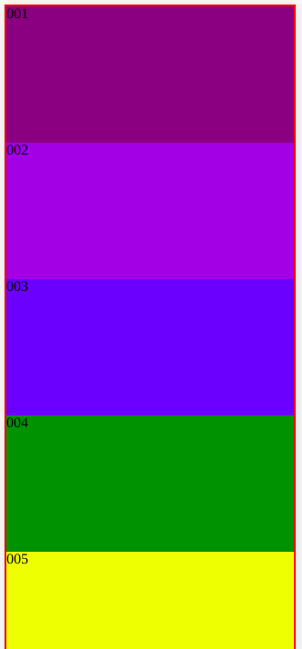
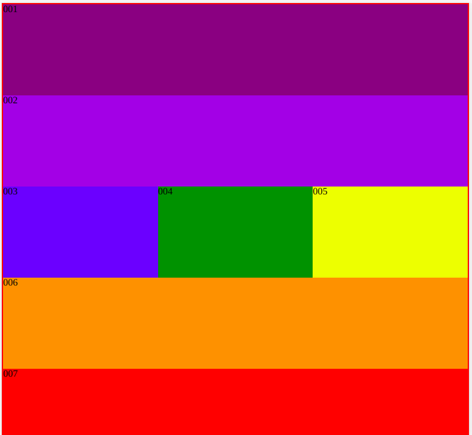
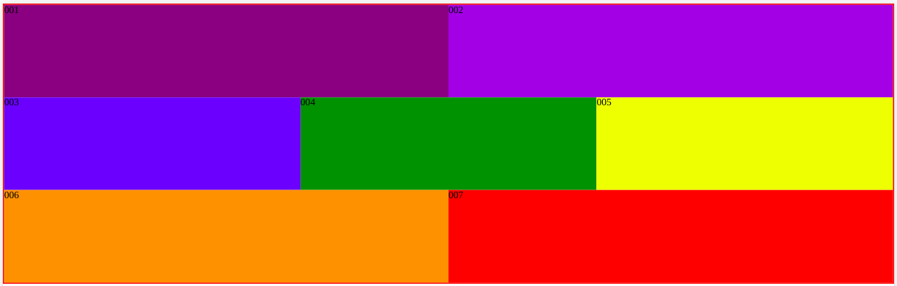

# Flex even

## 7 Boxes

1. Create 7 Boxes with Flexbox & Mediaqueries.
2. There are 7 boxes on the page, each has a color. Style the boxes as follows:

   * 0px-600px: boxes 1-7 should each take up 100% of one row

   * 601px-800px: boxes 1 and 2 should each take 100% of one row, 3, 4 and 5 should each take up 33.33% of 1 row, and 6 and 7 should each take up 100% of one row
   * 801px +: boxes 1 and 2 should each take up 50% of one row, 3, 4 and 5 each should take up 33.33% of 1 row, and 6 & 7 should each take up 50% of one row

Images for reference:
| Mobile | Tablet | Desktop |
| --- | --- | ---  |
|  |  |  |
